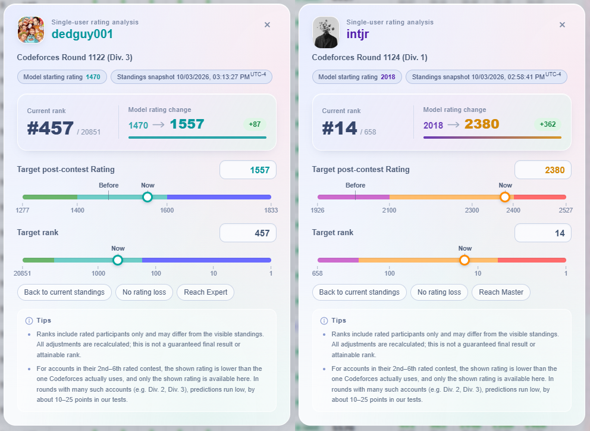
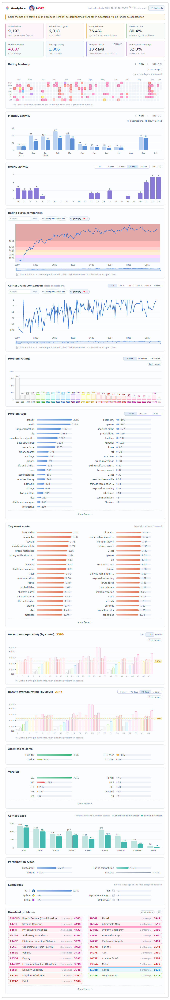

<h1 align="center"> Colorforces</h1>

<p align="center">
  <strong>English</strong> | <a href="docs/README_zh.md">简体中文</a>
</p>

<p align="center">
  <a href="docs/CHANGELOG.md">
    
  </a>
  <a href="https://github.com/GodExious/Colorforces/blob/main/LICENSE">
    
  </a>
  <a href="https://www.tampermonkey.net/">
    
  </a>
  <a href="https://codeforces.com/">
    
  </a>
</p>

Colorforces is a userscript that makes Codeforces problem ratings, submissions, and user information easier to read and customize, and adds contest rating prediction. The primary target environment is **Chrome + Tampermonkey**.

> Previously [CF-Submissions-Ratings](https://github.com/GodExious/CF-Submissions-Ratings), renamed as its scope expanded beyond problem ratings.

## ✨ Features

- Problem ratings from Codeforces and CList, shown as colored blocks or tags
- User data analytics on profile pages: a summary, rating heatmap, rating and rank curve comparison, and a dozen more charts
- Contest rating prediction with single-user rating analysis
- Participant tags, user avatars, language icons, short verdicts, and custom time formats
- Shortcuts, storage management, and a bilingual (English / Chinese) menu

## 📸 Screenshots

<p align="center">
  
  <br>
  <em>Settings menu in English and Chinese</em>
</p>
<p align="center">
  
  <br>
  <em>Added problem rating color display to problem tags</em>
</p>
<p align="center">
  
  <br>
  <em>CF and CList ratings in block and tag styles (selected real submissions)</em>
</p>
<p align="center">
  
  <br>
  <em>Seamless integration with your highlighted rows on the Submissions page</em>
</p>
<p align="center">
  
  <br>
  <em>Optimized difficulty rating and AC status display on the Contest problem list</em>
</p>
<p align="center">
  
  <br>
  <em>Problem ratings, participant tags, and rating prediction columns on the Contest standings page</em>
</p>
<p align="center">
  
  <br>
  <em>Single-user rating analysis: drag or enter a target rating or rank to see the outcome</em>
</p>
<p align="center">
  
  <br>
  <em>User avatar display on the Blogs content page</em>
</p>
<p align="center">
  
  <br>
  <em>User data analytics on profile pages: a summary, rating heatmap, rating and rank curve comparison, and a dozen more charts</em>
</p>

## 🚀 Installation

1. Install a user script manager like [Tampermonkey](https://www.tampermonkey.net/) for your browser.
2. Click the link below to install the script directly:

   👉 **[Install Colorforces](https://github.com/GodExious/Colorforces/releases/latest/download/colorforces.user.js)**

3. Open or refresh a Codeforces page. Click the flower button near the upper-right corner to open settings. Common toggles also have keyboard shortcuts, which you can view and change on the Shortcuts page of the menu.

## 🛠️ Build from Source

Requirements:

- Node.js: 20.x at 20.19.0 or later, or 22.12.0 or later
- npm

Install dependencies and build:

```sh
npm ci
npm run build
```

Install the generated `dist/colorforces.user.js` in Tampermonkey.

---

To also update the root compatibility copy:

```sh
npm run build:compat
```

To run the unit tests:

```sh
npm test
```

## 💡 Feedback

If you have any suggestions, feature requests, or find any bugs, please feel free to open an [Issue](https://github.com/GodExious/Colorforces/issues) in this repository! Contributions and Pull Requests are always welcome.

## 👏 Acknowledgments

| Project | Contribution | Links |
| :--- | :--- | :--- |
| Codeforces | The excellent contest environment and training experience, and the open official API. | <a href="https://codeforces.com/"></a> |
| Codeforces-Helper | The original inspiration for this project. | <a href="https://chromewebstore.google.com/detail/codeforces-helper/ahoeafmlmoohkkalcickdnkifpfnolpj"></a> |
| CList | The additional problem-rating data source. | <a href="https://clist.by/"></a> |
| OJ Better | Inspiration for integrating CList ratings. | <a href="https://github.com/beijixiaohu/OJBetter"></a> |
| Carrot-Plus | The reference for the built-in contest rating prediction. | <a href="https://github.com/wuyuqian114514/carrot-plus"></a> |
| atcoder-standings-difficulty-analyzer | The algorithm reference for in-depth contest analysis. | <a href="https://github.com/iilj/atcoder-standings-difficulty-analyzer"></a> |
| CF Analytics Pro Max | The reference for the statistics and charts of the built-in user data analytics. | <a href="https://chromewebstore.google.com/detail/codeforces-analytics-pro/gfoledimnmjchddncmedpcieiccnagcj"></a> <a href="https://greasyfork.org/zh-CN/scripts/465176-cf%E8%A7%A3%E9%A2%98%E6%95%B0%E6%8D%AE%E5%8F%AF%E8%A7%86%E5%8C%96-pro-max"></a> |
| Codeforces Rating-Based Heatmap | Inspiration for the rating heatmap in the built-in user data analytics. | <a href="https://chromewebstore.google.com/detail/codeforces-rating-based-h/heajdhmohlobjebkgkpdomkaihaghkgb"></a> |

## 📄 License

Released under the [MIT License](LICENSE).
