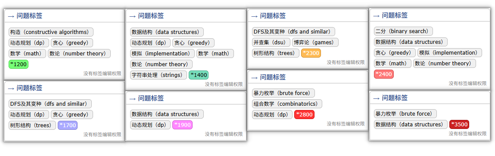
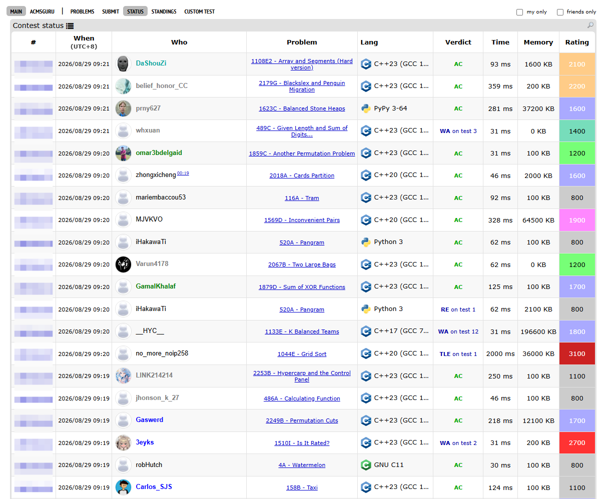
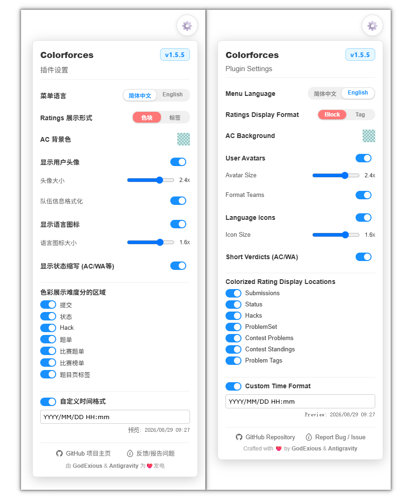
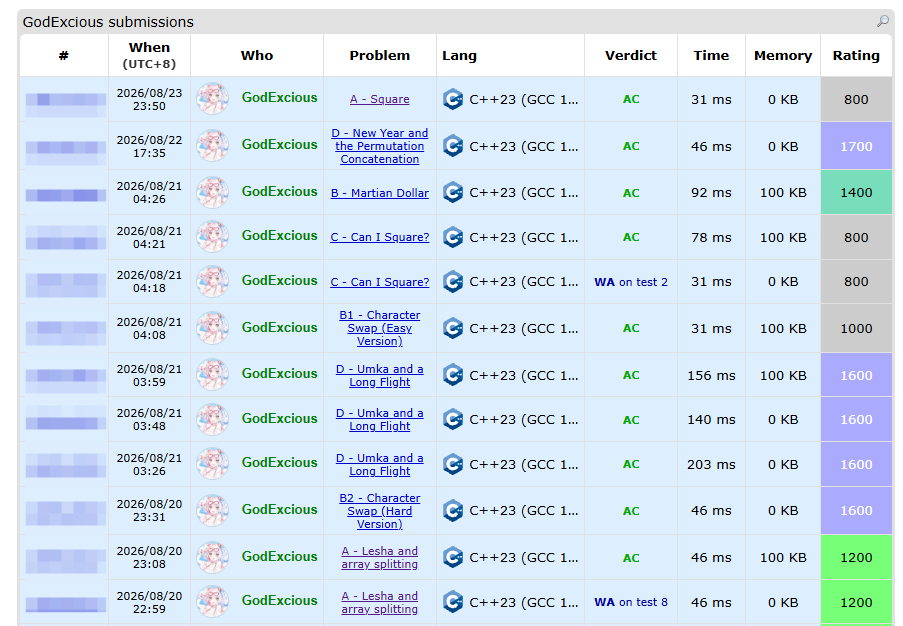
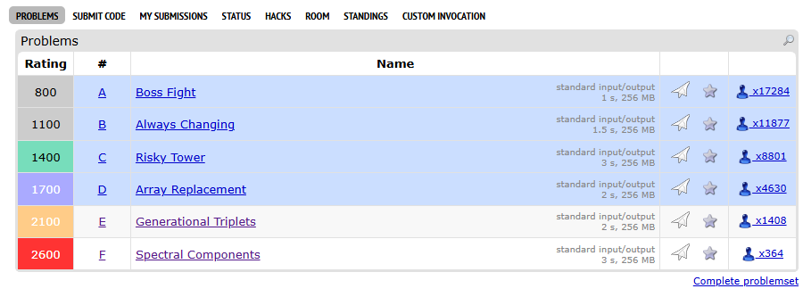
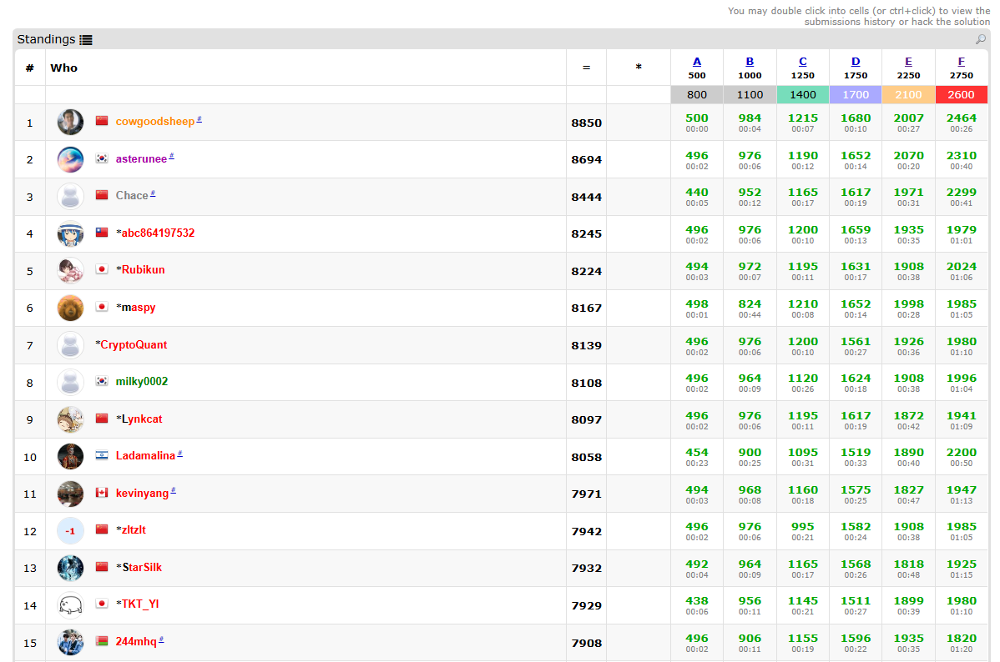
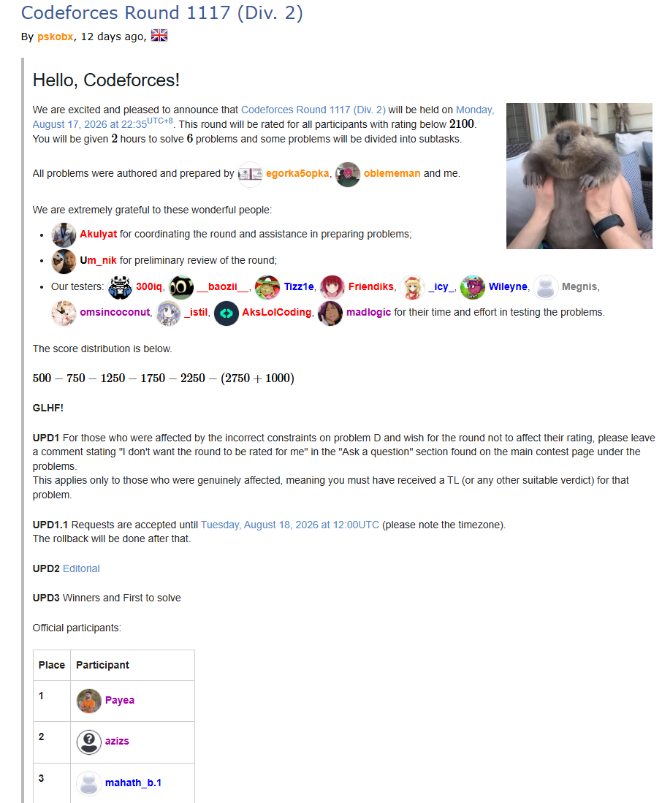

<h1 align="center">Colorforces</h1>

  <a href="../README.md">English</a> | <strong>简体中文</strong>

  
  
  

> [!NOTE]  
> 
> 本项目由原 **[CF-Submissions-Ratings](https://github.com/GodExious/CF-Submissions-Ratings)** 迁移而来。
> 
> 由于当前的开发方向与最初仅为了显示 Ratings 的目的已相差甚远，我们将项目正式更名为 **Colorforces**，并在此开启全新的篇章。

重塑 Codeforces 视觉体验的新一代增强插件。通过动态的评分色彩、现代化的标签引擎和极高自由度的定制面板，为你的算法竞赛之旅注入全新的生命力。

## 📸 效果预览

  
   
  <em>题目页面的 Rating 颜色标签显示</em>

  
   
  <em>Status 页面的分数直显与时间格式化效果</em>

  
   
  <em>悬浮设置面板</em>

  
   
  <em>完美兼容个人 Submissions 记录自带的背景高亮</em>

  
   
  <em>Contest 题单页面的难度分与 AC 状态展示</em>

  
   
  <em>Contest 排名页面的难度分展示</em>

  
   
  <em>博客内容页面的用户头像展示</em>

## ✨ 功能特点
- **🧠 全局难度直显**：在提交、状态、题单、榜单等所有核心页面无缝嵌入题目难度分。支持自由切换「经典色块」与「高级标签」两种 UI 风格。
- **🎨 视觉体验重构**：自动抓取并显示用户头像与专属编程语言图标（如 C++、Python、Go 等），并提供极简的判题状态缩写（如 `WA`、`TLE`）。
- **⚙️ 全能控制面板**：悬浮式双语（中/英）配置中心。支持全模块独立开关、自定义时间格式化、图标缩放及专属 AC 颜色定制。
- **⚡ 零感性能开销**：依托 Codeforces 官方 API 并结合强效的本地缓存策略，每天仅需一次静默更新，完全不拖累网页加载速度。
## 🚀 安装说明
1. 首先，在你的浏览器上安装 [Tampermonkey (油猴)](https://www.tampermonkey.net/) 脚本管理器。
2. 点击下方链接一键安装脚本：
   
   👉 **[点击安装 Colorforces](https://raw.githubusercontent.com/GodExious/Colorforces/main/colorforces.user.js)**

   > *注：如果你已经 clone 了本仓库，也可以手动将 `colorforces.user.js` 的代码复制到油猴新建的脚本中。*

3. 打开或刷新 Codeforces 的任意 Status 页面，享受难度直显带来的刷题快感！

## 💡 意见与反馈
如果你对本插件有任何好点子、改进建议，或者发现了 Bug，非常欢迎到 [GitHub Issues](https://github.com/GodExious/Colorforces/issues) 中提出反馈与讨论！也随时欢迎提交 Pull Requests。

## 👏 鸣谢
本插件主要受到 [Codeforces-Helper](https://chromewebstore.google.com/detail/codeforces-helper/ahoeafmlmoohkkalcickdnkifpfnolpj) 的启发。由于该插件不支持在 `status` 页面展示题目分数，因此我让 AI (Antigravity 1.23.2) 帮我仿写并实现了本项目。

## 📄 License
本项目基于 [MIT License](../LICENSE) 协议开源。
