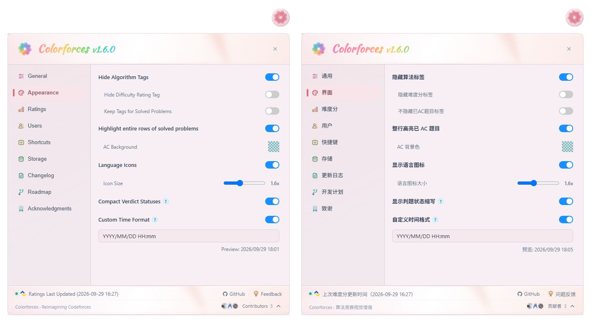
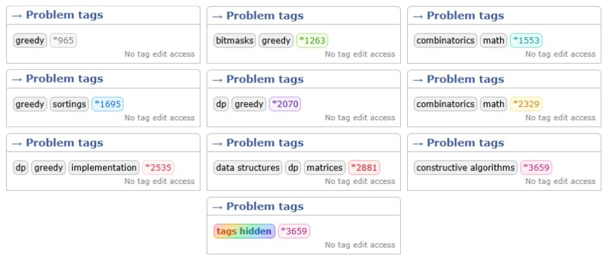
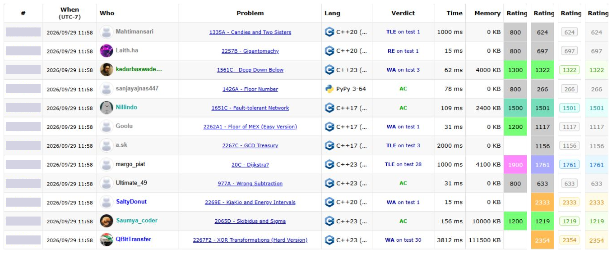
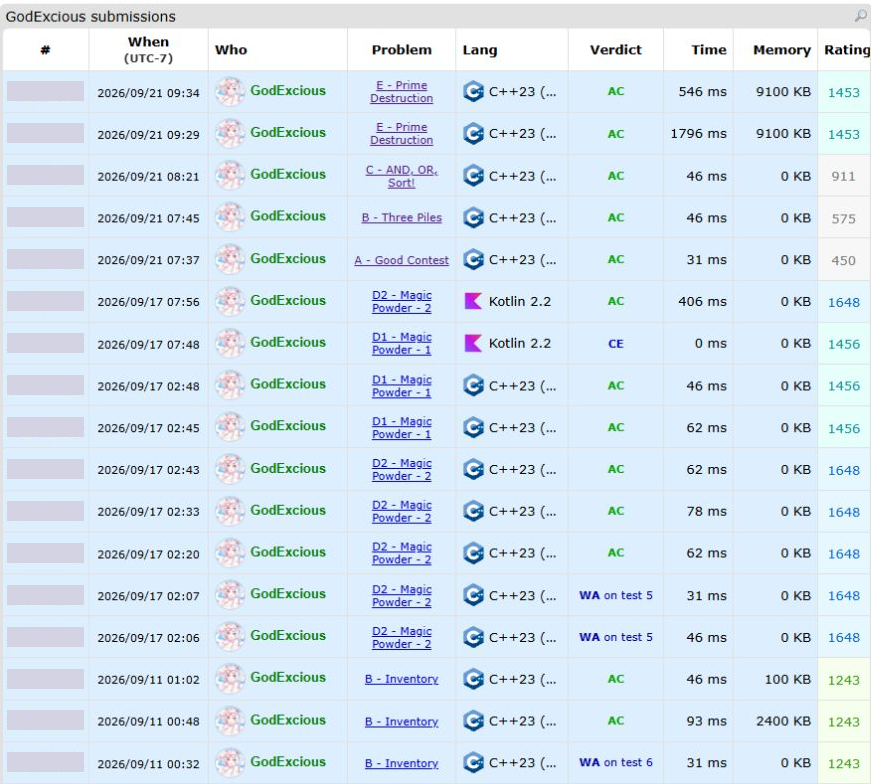
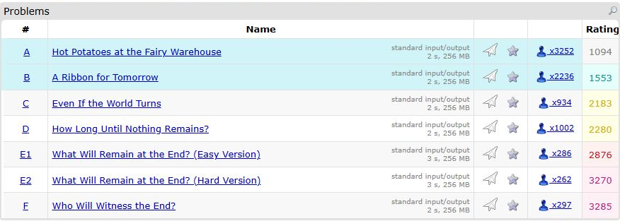
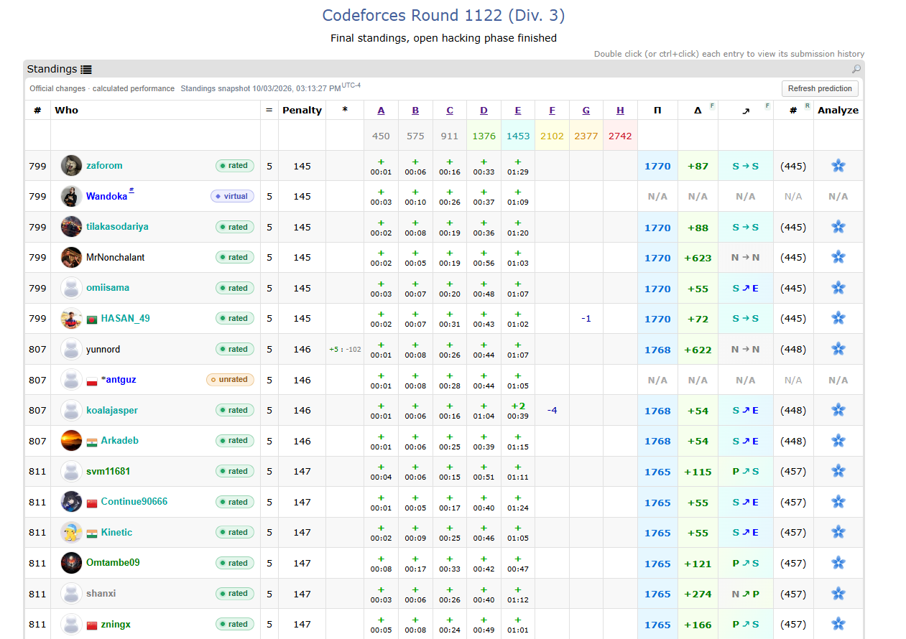
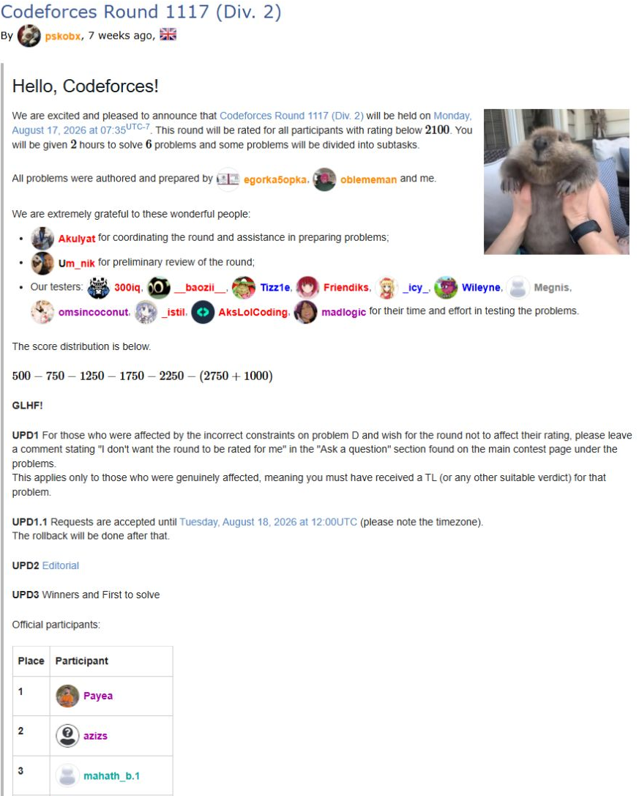

<h1 align="center"> Colorforces</h1>

<p align="center">
  <a href="../README.md">English</a> | <strong>简体中文</strong>
</p>

<p align="center">
  <a href="CHANGELOG_zh.md">
    
  </a>
  <a href="https://github.com/GodExious/Colorforces/blob/main/LICENSE">
    
  </a>
  <a href="https://www.tampermonkey.net/">
    
  </a>
  <a href="https://codeforces.com/">
    
  </a>
</p>

Colorforces 是一个 Codeforces 页面增强油猴脚本，让题目难度、提交状态和用户信息更直观，并提供可自定义的展示方式。主要使用环境为 **Chrome + Tampermonkey（油猴）**。

> 本项目由 [CF-Submissions-Ratings](https://github.com/GodExious/CF-Submissions-Ratings) 更名而来，功能已从题目难度分展示扩展为 Codeforces 页面增强。

## 📸 效果预览

<p align="center">
  
  <br>
  <em>中英文设置菜单</em>
</p>
<p align="center">
  
  <br>
  <em>题目页面的 Rating 颜色标签显示</em>
</p>
<p align="center">
  
  <br>
  <em>CF 与 CList 分数、色块与标签样式对照（真实提交节选）</em>
</p>
<p align="center">
  
  <br>
  <em>完美兼容个人 Submissions 记录自带的背景高亮</em>
</p>
<p align="center">
  
  <br>
  <em>Contest 题单页面的难度分与 AC 状态展示</em>
</p>
<p align="center">
  
  <br>
  <em>Contest 排名页面的难度分展示</em>
</p>
<p align="center">
  
  <br>
  <em>博客内容页面的用户头像展示</em>
</p>

## 🚀 安装说明

1. 首先，在你的浏览器上安装 [Tampermonkey (油猴)](https://www.tampermonkey.net/) 脚本管理器。
2. 点击下方链接一键安装脚本：

   👉 **[点击安装 Colorforces](https://github.com/GodExious/Colorforces/releases/latest/download/colorforces.user.js)**

   首个 Release 发布前，可以使用[旧版兼容安装入口](https://raw.githubusercontent.com/GodExious/Colorforces/main/colorforces.user.js)。

   > _注：也可以按下方指南本地构建，将生成的 `dist/colorforces.user.js` 安装到油猴。_

3. 打开或刷新 Codeforces 页面，点击页面右上方附近的花瓣按钮进入设置。

## 🛠️ 从源码构建

环境：Node.js 20.x（≥20.19.0）或 ≥22.12.0，以及 npm。

```sh
npm ci
npm run build
```

将生成的 `dist/colorforces.user.js` 安装到油猴即可。如需同步根目录兼容副本，使用 `npm run build:compat`。

## 💡 意见与反馈

如果你对本插件有任何好点子、改进建议，或者发现了 Bug，非常欢迎到 [GitHub Issues](https://github.com/GodExious/Colorforces/issues) 中提出反馈与讨论！也随时欢迎提交 Pull Requests。

## 👏 致谢

- [Codeforces-Helper](https://chromewebstore.google.com/detail/codeforces-helper/ahoeafmlmoohkkalcickdnkifpfnolpj)：本项目最初的灵感来源。
- [CList](https://clist.by/)：提供额外的题目难度数据。
- [OJ Better](https://github.com/beijixiaohu/OJBetter)：提供页面增强功能的启发。
- [Carrot-Plus](https://github.com/wuyuqian114514/carrot-plus)：为计划中的表现分变化预测功能提供参考。
- **CF Analytics Pro Max**（[浏览器扩展](https://chromewebstore.google.com/detail/codeforces-analytics-pro/gfoledimnmjchddncmedpcieiccnagcj) · [油猴脚本](https://greasyfork.org/zh-CN/scripts/465176-cf%E8%A7%A3%E9%A2%98%E6%95%B0%E6%8D%AE%E5%8F%AF%E8%A7%86%E5%8C%96-pro-max)）：本插件计划在后续版本提供类似的内置数据分析功能。

## 📄 License

本项目基于 [MIT License](../LICENSE) 协议开源。
