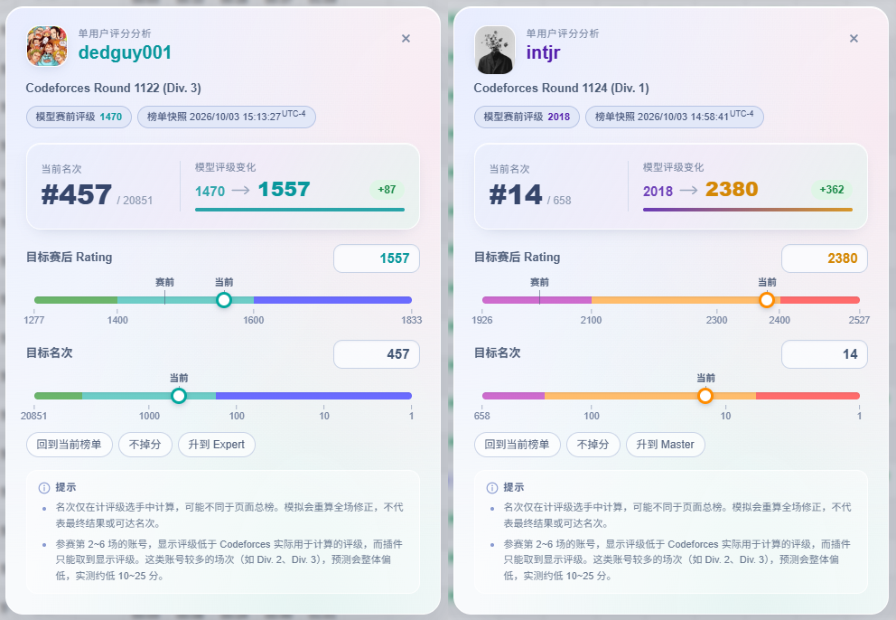
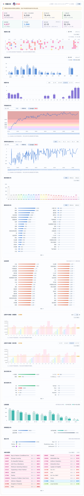

<h1 align="center"> Colorforces</h1>

<p align="center">
  <a href="../README.md">English</a> | <strong>简体中文</strong>
</p>

<p align="center">
  <a href="CHANGELOG_zh.md">
    
  </a>
  <a href="https://github.com/GodExious/Colorforces/blob/main/LICENSE">
    
  </a>
  <a href="https://www.tampermonkey.net/">
    
  </a>
  <a href="https://codeforces.com/">
    
  </a>
</p>

Colorforces 是一个 Codeforces 页面增强油猴脚本，让题目难度、提交状态和用户信息更直观，提供比赛评分预测，并支持自定义展示方式。主要使用环境为 **Chrome + Tampermonkey（油猴）**。

> 本项目由 [CF-Submissions-Ratings](https://github.com/GodExious/CF-Submissions-Ratings) 更名而来，功能已从题目难度分展示扩展为 Codeforces 页面增强。

## ✨ 功能特性

- 题目难度分着色：支持 CF 官方与 CList 数据，色块、标签两种样式
- 用户数据分析：在个人主页展示统计摘要、难度热力图、评级与排名曲线对比等十余种图表
- 比赛评分预测与单用户评级分析
- 选手参赛类型标签、用户头像、语言图标、判题缩写与自定义时间格式
- 快捷键、存储管理与中英双语菜单

## 📸 效果预览

<p align="center">
  
  <br>
  <em>中英文设置菜单</em>
</p>
<p align="center">
  
  <br>
  <em>题目页面的 Rating 颜色标签显示</em>
</p>
<p align="center">
  
  <br>
  <em>CF 与 CList 分数、色块与标签样式对照（真实提交节选）</em>
</p>
<p align="center">
  
  <br>
  <em>完美兼容个人 Submissions 记录自带的背景高亮</em>
</p>
<p align="center">
  
  <br>
  <em>Contest 题单页面的难度分与 AC 状态展示</em>
</p>
<p align="center">
  
  <br>
  <em>Contest 排名页面的难度分、选手标签与评分预测列展示</em>
</p>
<p align="center">
  
  <br>
  <em>单用户评级分析：拖动或输入目标评级、目标名次，查看对应结果</em>
</p>
<p align="center">
  
  <br>
  <em>博客内容页面的用户头像展示</em>
</p>
<p align="center">
  
  <br>
  <em>个人主页的用户数据分析：统计摘要、难度热力图、评级与排名曲线对比等十余种图表</em>
</p>

## 🚀 安装说明

1. 首先，在你的浏览器上安装 [Tampermonkey (油猴)](https://www.tampermonkey.net/) 脚本管理器。
2. 点击下方链接一键安装脚本：

   👉 **[点击安装 Colorforces](https://github.com/GodExious/Colorforces/releases/latest/download/colorforces.user.js)**

   > _注：也可以按下方指南本地构建，将生成的 `dist/colorforces.user.js` 安装到油猴。_

3. 打开或刷新 Codeforces 页面，点击页面右上方附近的花瓣按钮进入设置。常用开关支持快捷键，可在菜单的「快捷键」页查看和修改。

## 🛠️ 从源码构建

环境要求：

- Node.js：20.19.0 及以上的 20.x 版本，或 22.12.0 及以上
- npm

安装依赖并构建：

```sh
npm ci
npm run build
```

将生成的 `dist/colorforces.user.js` 安装到油猴即可。

---

如需同步根目录兼容副本：

```sh
npm run build:compat
```

运行单元测试：

```sh
npm test
```

## 💡 意见与反馈

如果你对本插件有任何好点子、改进建议，或者发现了 Bug，非常欢迎到 [GitHub Issues](https://github.com/GodExious/Colorforces/issues) 中提出反馈与讨论！也随时欢迎提交 Pull Requests。

## 👏 致谢

| 项目 | 说明 | 链接 |
| :--- | :--- | :--- |
| Codeforces | 提供优质的比赛环境与训练体验，并开放官方 API。 | <a href="https://codeforces.com/"></a> |
| Codeforces-Helper | 本项目最初的灵感来源。 | <a href="https://chromewebstore.google.com/detail/codeforces-helper/ahoeafmlmoohkkalcickdnkifpfnolpj"></a> |
| CList | 提供额外的题目难度数据。 | <a href="https://clist.by/"></a> |
| OJ Better | 带来集成 CList 难度分的启发。 | <a href="https://github.com/beijixiaohu/OJBetter"></a> |
| Carrot-Plus | 为内置的比赛评分预测功能提供算法参考。 | <a href="https://github.com/wuyuqian114514/carrot-plus"></a> |
| atcoder-standings-difficulty-analyzer | 为比赛的深入分析提供算法参考。 | <a href="https://github.com/iilj/atcoder-standings-difficulty-analyzer"></a> |
| CF Analytics Pro Max | 为内置的用户数据图表分析功能提供统计维度与图表设计的参考。 | <a href="https://chromewebstore.google.com/detail/codeforces-analytics-pro/gfoledimnmjchddncmedpcieiccnagcj"></a> <a href="https://greasyfork.org/zh-CN/scripts/465176-cf%E8%A7%A3%E9%A2%98%E6%95%B0%E6%8D%AE%E5%8F%AF%E8%A7%86%E5%8C%96-pro-max"></a> |
| Codeforces Rating-Based Heatmap | 为内置的用户数据分析提供难度热力图的启发。 | <a href="https://chromewebstore.google.com/detail/codeforces-rating-based-h/heajdhmohlobjebkgkpdomkaihaghkgb"></a> |

## 📄 License

本项目基于 [MIT License](../LICENSE) 协议开源。
